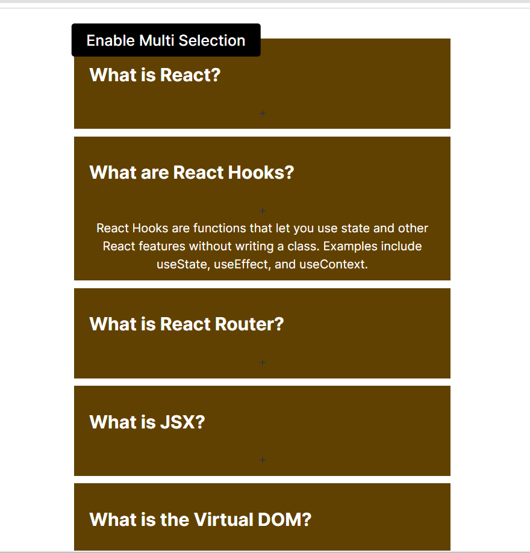
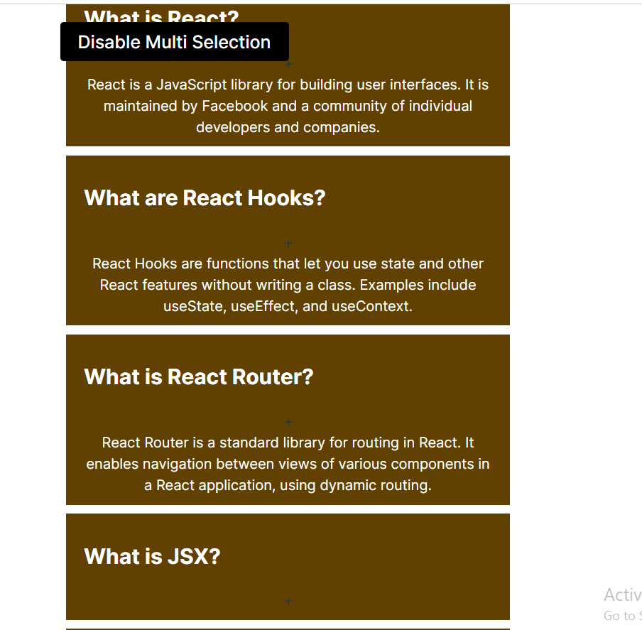

# React + Vite

This template provides a minimal setup to get React working in Vite with HMR and some ESLint rules.

Currently, two official plugins are available:

- [@vitejs/plugin-react](https://github.com/vitejs/vite-plugin-react/blob/main/packages/plugin-react/README.md) uses [Babel](https://babeljs.io/) for Fast Refresh
- [@vitejs/plugin-react-swc](https://github.com/vitejs/vite-plugin-react-swc) uses [SWC](https://swc.rs/) for Fast Refresh

# Accordion
------------------------------------------------------------------------------------------------------------------------------------

A fully reusable Accordion component in React that supports single selection and multiple selection modes. This component can display accordion items with content dynamically loaded from a data file, making it highly customizable and versatile for different use cases.

## Features
Single Selection Mode: Only one accordion item can be expanded at a time.
Multiple Selection Mode: Multiple accordion items can be expanded simultaneously.
Dynamic Data: Uses an external data file (accordionData) for easy configuration and reusability.
Responsive Design: Optimized for various screen sizes.
Fixed Toggle Button: The selection mode toggle button is fixed at the top center for easy access.

# Single and Multiple Selection
## Single Selection Mode:

Only one accordion item can be opened at a time.
Clicking an already open item will close it.

## Multiple Selection Mode:

Multiple accordion items can be opened simultaneously.
Clicking an already open item will close it.

## Toggle Between Modes
A fixed button is available at the top center of the page to switch between single and multiple selection modes:

## Enable Multiple Selection: Switches to multiple selection mode.
## Disable Multiple Selection: Switches back to single selection mode.

# Code Functionality
## Single Selection
Function: handleSingleSelection
Logic: If an accordion item is clicked, it opens and closes all others. If the same item is clicked again, it closes.
## Multiple Selection
Function: handleMultiSelection
Logic: Allows toggling open and close states for multiple accordion items independently.

## some Snapshot from project 

